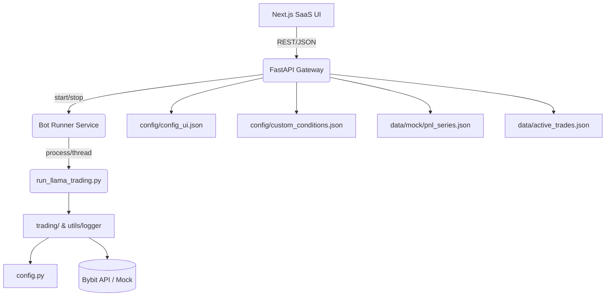

# AI-Lona SaaS Architecture Map

## 1. High-level topology
- **Core trading engine (`run_llama_trading.py`)** – orchestrates monitoring threads, reconciles exchange state and cycles through target discovery with scalping execution.【F:run_llama_trading.py†L1-L64】
- **Domain packages**
  - `trading/` – order execution, scalping strategies, and risk helpers tightly integrated with Bybit APIs.【F:trading/executor.py†L7-L369】【F:trading/scalping.py†L1-L1912】
  - `ai/` – signal evaluation, including SON rule engine with configurable custom conditions and rejection logging.【F:ai/check_trade_conditions.py†L1-L816】
  - `analysis/` – market data analytics and indicator calculation pipelines relying on klines retrieval helpers.【F:analysis/indicators.py†L1-L1120】【F:analysis/market.py†L1-L575】
  - `utils/` – infrastructure services: logging, exchange client wrappers, telegram bot hooks, data sanitisation and misc utilities.【F:utils/logger.py†L1-L420】【F:utils/tools.py†L1-L493】
- **Configuration layer (`config.py`)** – centralises API clients, UI-driven toggles, safety limits and smart-averaging profile loaded from `config/config_ui.json`, with a mock client fallback for keyless operation.【F:config.py†L1-L87】【F:config.py†L99-L141】
- **FastAPI gateway (`backend/app/`)** – new SaaS-ready API exposing bot control, configuration management, analytics and conditions editing endpoints.【F:backend/app/main.py†L1-L94】
- **Frontend scaffold (`frontend/`)** – Next.js dashboard and settings UI (see `docs/frontend-plan.md`).

## 2. Runtime dependency flow

## 3. Key files & responsibilities
| Area | Files | Responsibility |
|------|-------|----------------|
|Bot control|`run_llama_trading.py`, `backend/app/services/bot_runner.py`|Launches trading loop either as subprocess (live) or heartbeat mock; tracks runtime state for status endpoint.【F:run_llama_trading.py†L1-L64】【F:backend/app/services/bot_runner.py†L1-L122】|
|Signal engine|`ai/check_trade_conditions.py`, `config/custom_conditions.json`|Evaluates long/short decisions combining SON defaults with user-defined rule-sets, writes rejection diagnostics.【F:ai/check_trade_conditions.py†L1-L816】【F:config/custom_conditions.json†L1-L77】|
|Configuration|`config.py`, `backend/app/services/config_store.py`|Loads UI config overrides, persists updates from dashboard, enables DRY_RUN when running with mock client.【F:config.py†L16-L141】【F:backend/app/services/config_store.py†L1-L49】|
|Data access|`utils/logger.py`, `backend/app/services/trades.py`, `backend/app/services/analytics.py`|Manages active trades persistence, exposes read-only views for SaaS endpoints, supplies mock PnL series in offline mode.【F:utils/logger.py†L1-L564】【F:backend/app/services/trades.py†L1-L46】【F:backend/app/services/analytics.py†L1-L20】|
|Frontend|`frontend/app/`|Dashboard, Settings, Conditions editor, Keys, Auth scaffolding (see dedicated plan).|

## 4. Planned SaaS-facing endpoints
See [docs/integration_plan.md](integration_plan.md) for request/response schemas and orchestration notes.
